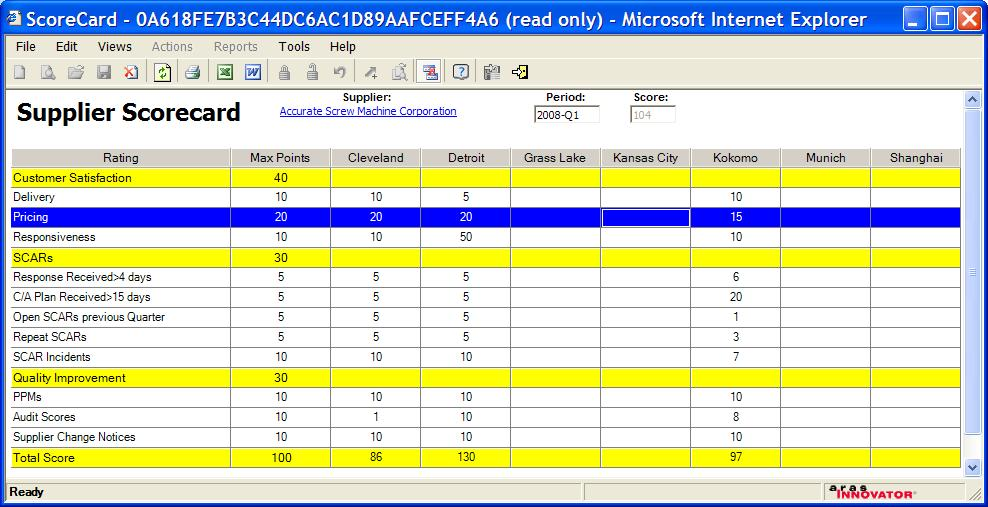

# Supplier Scorecards

Add-on for the Product Engineering solution.

Adds a tab to the Manufacturer item to hold ScoreCard data for that supplier. The data model supports many score cards per supplier (can be used to record periodic, such as Quarterly scorecard data).

**Note:** this package also uses the Location itemType from the standard Quality Planning solution. You need that loaded as well to use the package without modification.

Using Location, the data model and UI allows a Scorecard per supplier, per period, per company Location. The Scorecard has a rollup which is the average score made by each of the manufacturing locations.

## History

This project and the following release notes have been migrated from the old Aras Projects page. Unlike community projects that have been migrated and archived, this project will be updated for compatibility with the latest release of Aras Innovator.

Release | Notes
--------|--------
[v4](https://github.com/ArasLabs/supplier-scorecard/releases/tag/v4) | 	Updated to work with IE8 and 9.3
[v3](https://github.com/ArasLabs/supplier-scorecard/releases/tag/v3) | Initial release. Tested on 8.2.0 and 9.0.1

#### Supported Aras Versions

Project | Aras
--------|------
[v4](https://github.com/ArasLabs/supplier-scorecard/releases/tag/v4) | 9.3
[v3](https://github.com/ArasLabs/supplier-scorecard/releases/tag/v3) | 8.2.0, 9.0.1

## Installation

#### Important!
**Always back up your code tree and database before applying an import package or code tree patch!**

### Pre-requisites

1. Aras Innovator installed
2. Aras Package Import tool
3. Quality Planning solution is applied
4. **Scorecard** import package

### Install Steps

1. Backup your database and store the BAK file in a safe place.
2. Open up the Aras Package Import tool.
3. Enter your login credentials and click **Login**
  * _Note: You must login as root for the package import to succeed!_
4. Enter the package name in the TargetRelease field.
  * Optional: Enter a description in the Description field.
5. Enter the path to your local `..\supplier-scorecard\Import\imports.mf` file in the Manifest File field.
6. Select **Scorecard** in the Available for Import field.
7. Select Type = **Merge** and Mode = **Thorough Mode**.
8. Click **Import** in the top left corner.
9. Close the Aras Package Import tool.

## Usage

## Contributing

1. Fork it!
2. Create your feature branch: `git checkout -b my-new-feature`
3. Commit your changes: `git commit -am 'Add some feature'`
4. Push to the branch: `git push origin my-new-feature`
5. Submit a pull request

For more information on contributing to this project, another Aras Labs project, or any Aras Community project, shoot us an email at araslabs@aras.com.

## Credits

Created by Peter Schroer, Aras Corporation.

## License

Aras Labs projects are published to Github under the MIT license. See the [LICENSE file](./LICENSE.md) for license rights and limitations.
